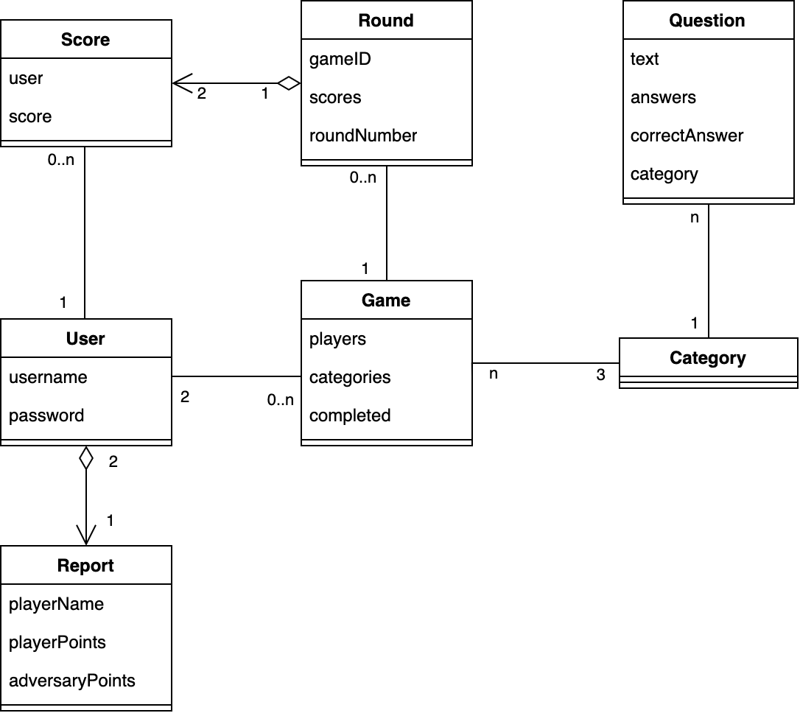

# Requisiti
Questa sezione esplora i requisiti del progetto, individuati durante l'analisi del dominio e le interviste con il committente.

## Requisiti di business
I requisiti di business sono quelli che descrivono le funzionalità del sistema dal punto di vista del committente e vengono individuati durante le interviste con il committente. Essi sono:
- Sviluppare un'applicazione per Desktop in Scala che implementi un gioco di quiz a risposta multipla.
- Il sistema deve supportare la creazione di partite interattive tra due giocatori, da svolgersi in modalità "hot seat" (i due giocatori si alternano sullo stesso dispositivo).
- Il gioco deve prevedere un numero fisso ed immutabile di domande (21) e risposte (4 per ogni domanda). Stesse condizioni valgono per le categorie di domande.
- L'applicazione deve fornire un'interfaccia grafica colorata e facile da usare.

## Modello di dominio
Il modello di dominio è un'astrazione del dominio del problema che rappresenta le entità principali e le relazioni tra di esse.
Nel contesto del gioco LambdaQuiz, è possibile individuare le seguenti entità principali:
- **User**: rappresenta un utente del sistema, che è anche un giocatore. Ogni utente ha un nome e una password;
- **Game**: rappresenta una partita del gioco. Ogni partita è caratterizzata dai due utenti che vi partecipano e da un totale di tre categorie di domande. Queste ultime vengono scelte casualmente ad ogni creazione del gioco e consentono ad entrambi i giocatori di sfidarsi su domande di uguale categoria.
- **Round**: rappresenta un round del gioco. Ogni round possiede un riferimento all'identificativo del gioco di appartenenza, il numero dello stesso e una lista di punteggi. Essa serve per tener traccia dei risultati parziali dei giocatori per quel round.;
- **Question**: rappresenta una domanda a cui rispondere durante una partita. Esse seguono il modello di domande a risposta multipla e possiedono quattro opzioni di risposta, di cui una sola è corretta Inoltre, ogni domanda è caratterizzata da una specifica categoria di appartenenza;
- **Category**: rappresenta le varie categorie a cui le domande possono appartenere. Vi è un numero prefissato di sette categorie, ognuna delle quali è caratterizzata dal suo nome;
- **Report**: rappresenta una statistica calcolata sulla base di uno specifico utente che mostra, per ogni partita effettuata, il punteggio dell'utente in questione e quello del relativo avversario. Inoltre, indica anche se quella partita si è conclusa con una vittoria, una sconfitta o un pareggio.
Di seguito, il diagramma ad alto livello del modello di dominio del gioco LambdaQuiz:

## Requisiti funzionali
I requisiti funzionali sono quelli che descrivono le funzionalità del sistema dal punto di vista dell'utente e vengono individuati durante l'analisi del dominio.

### Requisiti utente
- Gli utenti devono poter interagire con il gioco mediante un'interfaccia grafica;
- Gli utenti devono poter avviare il gioco con pochi clic, senza dover affrontare procedure complesse di accesso o registrazione;
- Gli utenti devono poter giocare contro un amico sulla stessa piattaforma, utilizzando la modalità "hot seat";
- Gli utenti devono poter creare un nuovo account, che consentirà loro di giocare e visualizzare le proprie statistiche;
- Gli utenti devono poter effettuare il login al sistema, che deve fallire se le credenziali inserite non sono corrette;
- Nella dashboard, gli utenti devono poter visualizzare una panoramica dell'eventuale partita in corso, che comprende l'esito dei round precedenti e il punteggio attuale dei giocatori;
- Gli utenti devono poter rispondere alle domande proposte durante una partita, scegliendo tra le quattro opzioni di risposta;
- Gli utenti devono poter interrompere temporaneamente il gioco e riprenderlo in un secondo momento dallo stesso punto in cui lo hanno lasciato;
- Ogni utente deve poter visualizzare una statistica personale e la classifica globale degli utenti.

### Requisiti di sistema
- Il sistema deve offrire un processo di registrazione semplice e veloce per permettere ai giocatori di iniziare a giocare rapidamente;
- Il sistema deve consentire la registrazione di nuovi utenti solo se il nome scelto non è già stato utilizzato;
- Il sistema non deve consentire l'accesso a due utenti con lo stesso nome;
- Il sistema deve supportare la modalità multi giocatore locale, consentendo a due giocatori di competere sullo stesso dispositivo.
- Il sistema deve informare gli utenti se accadono errori durante l'esecuzione di un'operazione;
- Il sistema deve garantire la persistenza dei dati degli utenti e delle partite giocate;
- Il sistema deve consentire l'inizio di una nuova partita solo se non ce n'è già una in corso;
- Una partita può iniziare solo se entrambi i giocatori hanno effettuato il login;
- Ad ogni creazione di una nuova partita, il sistema deve scegliere casualmente tre categorie di domande senza ripetizioni.
- Il sistema deve garantire che le domande proposte durante una partita siano delle stesse categorie per entrambi i giocatori;
- Il sistema deve garantire una gestione corretta dei turni, in modo che entrambi i giocatori abbiano la possibilità di rispondere allo stesso numero di domande;
- Il sistema non deve consentire agli utenti di aggiungere domande o categorie personalizzate.

## Requisiti non funzionali
- **Usabilità**: Il sistema deve essere intuitivo e facile da usare, con un'interfaccia utente chiara e ben organizzata. I giocatori devono poter interagire con il gioco senza difficoltà e comprendere le azioni disponibili;
- **Performance**: Il sistema deve essere reattivo e veloce, garantendo tempi di risposta brevi durante l'interazione con l'utente. In particolare, il tempo di risposta per la visualizzazione delle domande e la scelta delle risposte deve essere inferiore a 1 secondo. Similmente, il tempo per effettuare le operazioni di registrazione e login deve essere inferiore a 2 secondi;
- **Affidabilità**: Il sistema deve essere stabile e affidabile, garantendo una corretta gestione degli eventuali guasti o errori.

## Requisiti di implementazione
- **Linguaggio di programmazione**: Il sistema deve essere sviluppato interamente in Scala 3;
- **Interfaccia grafica**: Il sistema deve utilizzare JavaFX 21 per la creazione dell'interfaccia grafica;
- **Persistenza dei dati**: Il sistema deve utilizzare un database MongoDB per la memorizzazione dei dati degli utenti e delle partite giocate;
- **Gestione delle dipendenze**: Il sistema deve utilizzare SBT come strumento di build automation e gestione delle dipendenze;
- **Testing**: Il sistema deve essere testato mediante l'utilizzo di test di unità e di integrazione con ScalaTest;
- **Versioning**: Il codice sorgente deve essere tracciato utilizzando Git e ospitato su un repository remoto su GitHub;
- **Documentazione**: Il codice sorgente deve essere adeguatamente documentato, seguendo le linee guida di Scaladoc;
- **Continuous Integration**: Il sistema deve essere integrato con un servizio di Continuous Integration (CI) per garantire l'esecuzione della build e dei test ad ogni modifica caricata sul repository.

[Indietro](1-processo_di_sviluppo.md) | [Torna alla Home](index.md) | [Avanti](3-design_architetturale.md)
