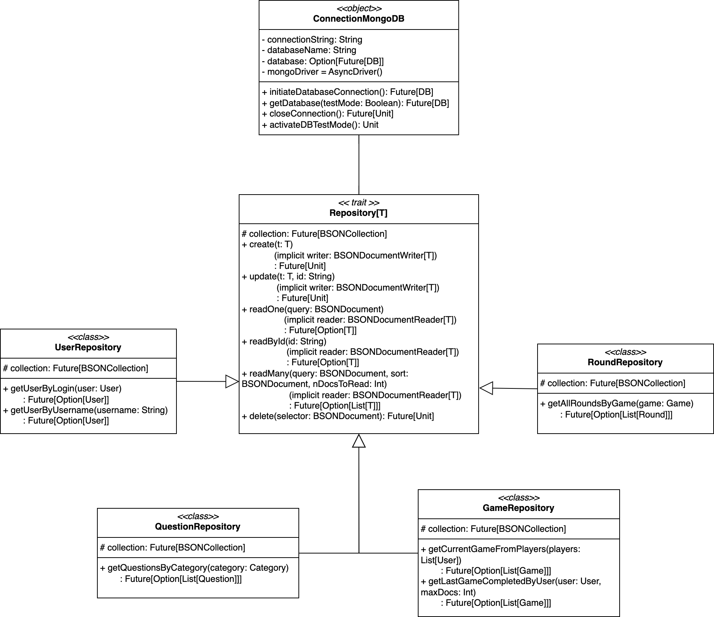
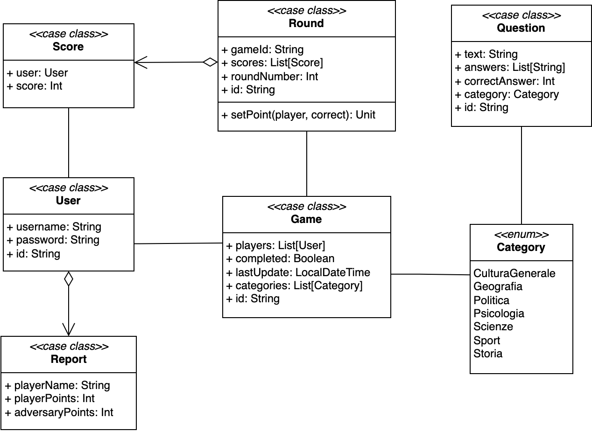

# Design di dettaglio

Questo capitolo illustra nel dettaglio il design del sistema LambdaQuiz, approfondendo tutti i componenti
dell'architettura citati in precedenza. Il sistema si compone di 4 package i quali vengono discussi nei paragrafi che
seguono:

## Business

Coincide con il package che implementa tutta la logica di interazione con il database, in modo da garantire la
persistenza dei dati.

Prima di tutto, esso contiene il componente che si occupa di gestire la connessione e disconnessione con il database
Mongo utilizzato. Tale componente fornisce i metodi per inizializzare la connessione, chiuderla e ottenere il
riferimento al database. Inoltre, consente anche di abilitare la modalità di test, che utilizza un database a parte per
evitare di sovrascrivere i dati di produzione in fase di testing.

Si è deciso di mappare le entità del modello con le collezioni del database, pertanto sono presenti tante collezioni
quanti sono gli elementi del dominio. Dal momento che questi ultimi condividono le stesse operazioni CRUD base, si è
optato per la definizione di un'interfaccia che fungesse da contratto per tutte le collezioni. Questa interfaccia,
implementata mediante un trait e denominata `Repository`, definisce le operazioni di base per la gestione delle entità,
come l'inserimento, la ricerca per ID, la ricerca per attributi e la cancellazione.

Ogni collezione è gestita da una particolare classe, denominata posponendo il termine "*repository*" al nome dell'entità
che viene gestita. Tali classi, si occupano di implementare le specifiche operazioni necessarie per la porzione di
dominio relativa, riutilizzando le procedure base presenti in `Repository`.

Nella figura seguente è mostrato il diagramma delle classi del package `business`:

## Model

Questo package contiene le classi che rappresentano le entità del gioco LambdaQuiz, le quali rispecchiano il modello di
dominio definito in fase di raccolta dei requisiti.

Ogni entità è definita per mezzo di una `case class`, all'interno della quale sono presenti tutti gli attributi e le
operazioni su di essi. Vi è poi il relativo companion-object che si occupa di istanziare le classi sfruttando il pattern
Factory Method.

Di seguito, la descrizione dettagliata delle classi presenti nel package `model`, visionabili anche nel diagramma
sottostante:

- **User**: rappresenta il singolo utente registrato al gioco ed è caratterizzato da:
    - _username_ - nome utente dell'utente
    - _password_ - password dell'utente
- **Game**: rappresenta la partita creata a partire dai due utenti che decidono di sfidarsi. È composta da:
    - _players_ - lista dei due utenti che partecipano al gioco
    - _completed_ - flag che indica se la partita è stata completata
    - _lastUpdate_ - data e ora dell'ultimo aggiornamento della partita
    - _categories_ - lista delle categorie di domande scelte per il gioco
- **Round**: rappresenta un singolo round di gioco, composto da:
    - _gameId_ - identificativo del gioco a cui il round fa riferimento
    - _roundNumber_ - numero del round
    - _scores_ - lista di punteggi ottenuti dai giocatori in quel round
- **Question**: rappresenta una domanda a risposta multipla, formata da:
    - _text_ - testo della domanda
    - _answers_ - lista delle risposte possibili
    - _correctAnswer_- indice della risposta corretta
    - _category_ - categoria a cui appartiene la domanda
- **Score**: rappresenta il punteggio di un utente ed è caratterizzato da:
    - _user_ - l'utente a cui il punteggio fa riferimento
    - _score_ - valore numerico del punteggio
- **Report**: rappresenta le statistiche di un utente, in termini di punti che esso ha accumulato rispetto
  all'avversario per ogni partita giocata. Questa entità è composta da:
    - _playerName_ - nome dell'utente a cui il report fa riferimento
    - _playerPoints_ - punteggio dell'utente che ha richiesto la statistica
    - _adversaryPoints_ - punteggio dell'avversario
- **Category**: rappresenta le categorie di appartenenza delle domande. A differenza delle entità precedenti, la
  presente è modellata usando un `enum` di Scala 3. Le possibili categorie previste dal gioco sono:
    - CulturaGenerale
    - Geografia
    - Politica
    - Psicologia
    - Scienze
    - Sport
    - Storia

Le classi `Game`, `Round`, `Question` e `User` possiedono un ulteriore attributo _id_ che funge da identificativo
univoco per la rispettiva entità all'interno del database. Esso viene generato casualmente utilizzando la classe `UUID`
di Java per poi andare a sostituire quello assegnato in automatico da mongoDB a tutti i documenti inseriti. Questa
scelta è stata presa per avere l'id sempre a disposizione, evitando ulteriori query al database per recuperarlo.

## Controller

In questo package sono presenti le classi che si occupano di gestire le interazioni tra l'utente e il sistema, in modo
da garantire la corretta esecuzione delle operazioni richieste. Nel rispetto del pattern architetturale MVC, i
controller sono stati progettati per reagire alle interazioni dell'utente con l'interfaccia grafica, per poi richiamare
le opportune funzioni della logica di business.

I controllers relativi agli utenti, alle partite, ai rounds e alle domande, presentano una struttura ben precisa.
Innanzitutto sono rappresentati da `object`, il che consente di avere un'unica istanza per ciascun controller, evitando
duplicazioni e garantendo la coerenza dei dati. Inoltre, ogni controller è dotato di un attributo che contiene l'oggetto
corrente relativo all'entità che gestisce. Questo attributo è inizializzato a `None` e viene popolato solo quando il
gioco giunge in una fase in cui è necessario accedere a tale entità. Ad esempio, il controller degli utenti, conterrà
gli oggetti degli utenti attualmente autenticati solo quando essi effettuano il login. Una tale struttura, facilita la
visualizzazione e la gestione del modello in quanto si ha sempre a disposizione l'entità corrente nell'apposito
controller.

Di seguito, vengono descritti i controller presenti in questo package:

- **GameController**: si occupa di gestire tutte le azioni effettuate dall'utente che impattano sui dati del Game. In
  particolare, implementa la logica relativa alle partite, come la creazione, la verifica della loro terminazione e
  altri metodi utili per il calcolo della classifica globale;
- **QuestionController**: si occupa di gestire la logica relativa alle domande. Più nel dettaglio, prepara la prossima
  domanda da mostrare all'utente in base all'attuale progresso della partita e verifica se ci sono ancora domande da
  mostrare per il round corrente;
- **RoundController**: si occupa della gestione dei round di gioco, orchestrando i turni dei giocatori e l'aggiornamento
  dei punteggi. Inoltre, si occupa di gestire il progresso della partita, verificando se è necessario passare al round
  successivo;
- **UserController**: si occupa di implementare le procedure di registrazione e autenticazione degli utenti, dialogando
  con il database per verificare la correttezza delle credenziali inserite e se il nome utente da registrare è già in
  uso;
- **ReportController**: si occupa di calcolare le statistiche per l'utente che lo richiede, strutturando i risultati in
  modo che la View possa visualizzarli in maniera rapida ed efficace.

## View

In questo package sono presenti le classi che si occupano di costruire e gestire l'interfaccia utente, in modo da
garantire una corretta visualizzazione delle pagine e delle informazioni. In particolare, tali classi sono state
progettate per reagire alle interazioni dell'utente con la GUI, per poi richiamare le opportune funzioni dei controller.

Sono stati previsti due sotto-package per organizzare in maniera più ordinata i vari componenti che compongono la View:

- `scenes`: contiene le classi che rappresentano le schermate visualizzate dall'utente, come il menu iniziale, la
  dashboard di gioco, la schermata delle statistiche e la classifica globale;
- `components`: contiene le classi che rappresentano i sotto elementi delle scene, come le risposte possibili a una
  domanda, i pulsanti per la navigazione tra le pagine e le finestre di dialogo per la registrazione e il login degli
  utenti.

Inoltre, è presente un oggetto `UIUtilis` che mette a disposizione una serie di utility per la gestione dell'interfaccia
grafica, come la creazione di bottoni, etichette e finestre di dialogo. Queste utility sono state progettate per
semplificare la creazione e la gestione dei componenti grafici, garantendo una maggiore coerenza ed evitando
duplicazioni di codice.

### Scenes

Raccoglie le classi che fungono da schermate per il gioco LambdaQuiz. Esse, al loro interno, contengono i vari
componenti grafici che compongono la pagina visualizzata dall'utente. Lato implementativo, questa struttura consente di
passare da una schermata all'altra in modo semplice e rapido.

Le schermate previste dal sistema sono le seguenti:

- **MenuScene**: pagina iniziale, visualizzata all'avvio del sistema. Contiene i pulsanti per accedere alle varie
  funzionalità del gioco, ovvero registrazione di un utente, accesso alle statistiche, accesso alla dashboard di gioco e
  uscita dall'applicazione.
- **DashboardScene**: rappresenta la schermata principale del gioco ed è accessibile solo previa autenticazione dei due
  utenti che si sfideranno. Essa consente loro di visualizzare una panoramica dell'eventuale partita in corso, di
  iniziarne una nuova o di accedere alla schermata di gioco vera e propria, dove verranno visualizzate le domande e le
  risposte.
- **QuizScene**: è la pagina in cui vengono visualizzate le domande e le risposte possibili. Sono inoltre presenti
  alcune informazioni di stato, come il nome dell'utente che deve rispondere e il numero della domanda corrente.
- **ReportScene**: schermata preposta alla visualizzazione delle statistiche di uno specifico giocatore. Si accede a
  essa dal menu iniziale ed è richiesta l'autenticazione di un utente per poter visualizzare i dati. Questa pagina
  mostra prima di tutto il numero totale di partite vinte e di quelle perse, seguito da due tabelle con i dettagli di
  ogni singola partita. La prima tabella visualizza la partita corrente, mentre la seconda mostra le partite passate.
  Esse sono composte da tre colonne: il nome dell'avversario, il punteggio dell'utente e il punteggio dell'avversario.
  Inoltre, è presente un pallino colorato che mostra l'esito parziale o finale della partita: verde per la vittoria,
  rosso per la sconfitta e giallo per il pareggio.
- **GlobalRankingScene**: pagina che visualizza la classifica globale dei giocatori, ordinati in base al numero di
  partite vinte. È accessibile dalla schermata dei report e non richiede un'ulteriore autenticazione. La classifica è
  composta da una semplice lista verticale che contiene i nomi dei 5 migliori giocatori.

### Components

Raccoglie le classi che rappresentano i componenti grafici che compongono le scene. In questo modo è possibile
riutilizzarli in più schermate, garantendo una maggiore coerenza e facilitando la manutenzione del codice.

[Indietro](3-design_architetturale.md) | [Torna alla Home](index.md) | [Avanti](5-implementazione.md)