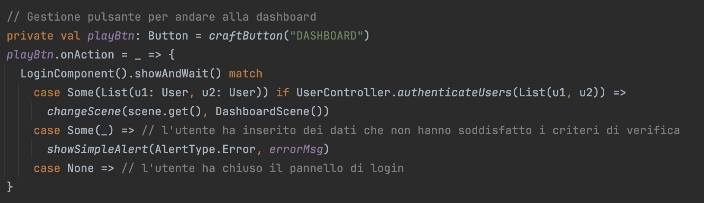

# Implementazione

Entrando nel dettaglio del lavoro svolto dal singolo membro del team, si riporta di seguito un resoconto delle parti svolte prevalentemente da Marco.

## Logica di business
Nella prima fase del progetto è stato fondamentale definire una logica dati su cui gettare le fondamenta della struttura del sistema. Questa parte, è stata svolta con sinergia da entrambi i membri del gruppo con Marco che ha avuto un maggior numero di task focalizzati sulla logica di business e repository dell'applicativo.
Di conseguenza, si è occupato di definire le funzioni che implementano le query per la scrittura, modifica ed estrazione dei dati, gestendo così la comunicazione con la base di dati MongoDB.
Questa parte ha avuto chiaramente risonanza su tutte le funzionalità dell'applicazione, sviluppate in seguito seguendo i pattern funzionali del linguaggio Scala.
Si sottolinea di nuovo come, essendo una parte iniziale del progetto, questa sia stata comunque seguita con l'affiancamento di Alberto, l'altro membro del team.

## Controller
Svolta la prima parte (più strutturale) del progetto, il duo ha continuato gli sviluppi dividendo il progetto in due parti: la prima più logica (backend) e la seconda più di vista (frontend), sviluppando comunque tutte le aree del sistema in Scala.
Seguendo questa divisione, Marco si è occupato prevalentemente della logica di gioco (gestita nel package dei controller).
In questa area del progetto, Marco ha lavorato sullo sviluppo degli algoritmi che si attivano in base alle interazioni dell'utente con il sistema (ad esempio la creazione di un nuovo match o la risposta a una domanda del quiz).
Ogni controller si occupa di un modello identificato nella base dati, gestendo così le interazioni con esso, come descritto precedentemente nel [paragrafo dedicato](../4-design_di_dettaglio.md#Controller).

## Uso della logica funzionale di Scala
Lo sviluppo in Scala ha permesso di sfruttare a pieno le potenzialità della logica funzionale, permettendo così di scrivere codice chiaro ed elegante.
Di seguito elenchiamo i punti chiave della logica funzionale che sono stati sfruttati nel codice.

### Pattern Matching
Il pattern matching è una tecnica potente ed espressiva che ha consentito di gestire diversi casi o pattern in modo chiaro e conciso.
Nell'immagine che segue si riporta un esempio di uso di pattern matching, sfruttato per sviluppare la gestione del login dell'utente.
In base al risultato ottenuto, in seguito all'interazione tra utente e finestra di login, si procede a eseguire elementi il ramo corrispondente:
- se il valore estratto è una lista contenente i due utenti che stanno provando a fare login, allora quest'ultimo è andato a buon fine si viene reiderizzati alla Dashboard.
- se si ottiene qualsiasi altro valore, allora le credenziali di login sono errate e viene segnalato all'utente tramite un messaggio.
- se non si ottiene un risultato, allora l'utente ha chiuso la finestra di login, senza quindi provare ad accedere.

### Funzioni Anonime
Le funzioni anonime, o lambda, sono un'altra caratteristica importante del codice presentato, che consente di definire funzioni in linea senza dover dare loro un nome esplicito.
Nel progetto, c'è stato modo in molte occasioni di utilizzare le funzioni anonime per definire comportamenti specifici all'interno del gioco.

### Immutabilità e Strutture Dati Persistenti
Seguendo le buone norme di Scala, il codice del progetto è stato basato incoraggiando l'uso di strutture dati immutabili e persistenti, che consentono di evitare effetti collaterali e semplificare la gestione degli stati.
Nel progetto, si è potuto sfruttare le strutture dati immutabili per rappresentare lo stato del gioco in modo chiaro e sicuro, garantendo che le modifiche allo stato non potessero causare effetti indesiderati o comportamenti imprevisti.

In conclusione, sfruttando le sintassi del linguaggio funzionale di Scala, è stato possibile potuto creare un progetto scalabile che risponde alle esigenze dei requisiti iniziali in modo efficiente e affidabile.
L'uso di una corretta logica funzionale ha contribuito alla realizzazione di un codice conciso, modulare e facilmente testabile.